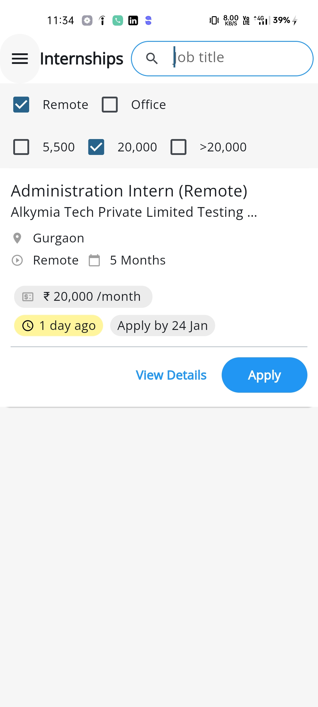

# internsala 

# Overview
This Flutter project fetches internships and job openings from an internet API and displays them through an interactive user interface. The app includes filtering features to enhance the user experience.


## Features

- **Fetch Data from API:** The app makes network requests to retrieve internships and job openings from an internet API. 
- **Interactive User Interface:** Displays all the internships and job openings in a user-friendly manner.
- **Filtering Options:**
  - **By Job Title** Easily filter employees based on gender.
  - **By Work Type:** Select any desired age range using the Flutter Slider widget.
  - **By Salary:** Select any desired age range using the Flutter Slider widget.

## Technology Used

- **Flutter & Dart:** 
- **State Management:** 
  - **Flutter Riverpod** 
- **Route Management:**   
  - **Go Router** .

## Screenshots
<div style=align-items: center;>
  
  
  
  
</div>

## Installation

1. **Clone the Repository**
   ```bash
   git clone https://github.com/Ankush1200/Internsala.git

2. **Install dependencies**
   ```bash
   flutter pub get
3. **Run the app**
   ```bash
   flutter run

**Download APK**
    ```bash
    build\app\outputs\flutter-apk\app-release.apk (20.5MB)


## Contribution
Contributions are welcome! Please fork this repository and submit a pull request for any feature enhancements or bug fixes.

## Contact
- **Email**: ankush78607@gmail.com.
- **GitHub**: https://github.com/Ankush1200.
